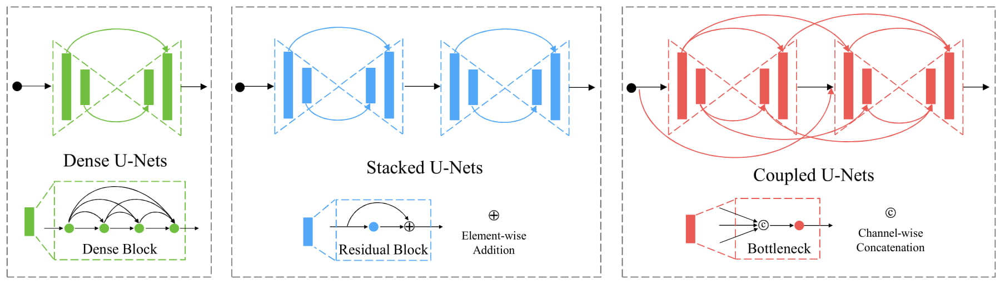
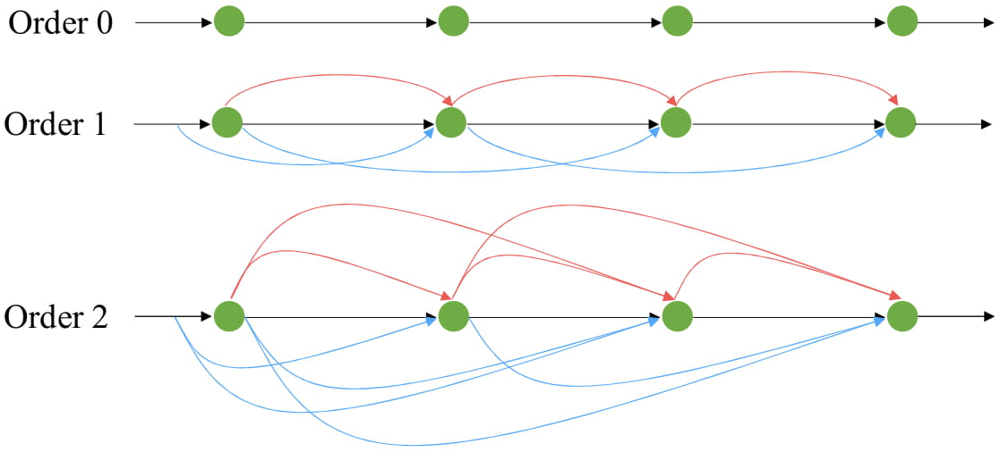

# 
## **[Quantized Densely Connected U-Nets for Efficient Landmark Localization](https://arxiv.org/abs/1808.02194)**
## **[CU-Net: Coupled U-Nets](https://arxiv.org/abs/1808.06521)**

## Overview
The follwoing figure gives an illustration of naive dense U-Net, stacked U-Nets and coupled U-Nets (CU-Net). The naive dense U-Net and stacked U-Nets have shortcut connections only inside each U-Net. In contrast, the coupled U-Nets also have connections for semantic blocks across U-Nets. The CU-Net is a hybrid of naive dense U-Net and stacked U-Net, integrating the merits of both dense connectivity, intermediate supervisions and multi-stage top-down and bottom-up refinement. The resulted CU-Net could save ~70% parameters of the previous stacked U-Nets but with comparable accuracy.
<p align="center"></p>

If we couple each U-Net pair in multiple U-Nets, the coupling connections would have quadratic growth with respect to the U-Net number. To make the model more parameter efficient, we propose the order-K coupling to trim off the long-distance coupling connections.
<p align="center"></p>
For simplicity, each dot represents one U-Net. The red and blue lines are the shortcut connections of inside semantic blocks and outside inputs. Order-0 connectivity (Top) strings U-Nets together only by their inputs and outputs, i.e. stacked U-Nets. Order-1 connectivity (Middle) has shortcut connections for adjacent U-Nets. Similarly, order-2 connectivity (Bottom) has shortcut connections for 3 nearby U-Nets.

### Prerequisites

This package has the following requirements:

* `Python 2.7`
* `Pytorch v0.4.0` or `Pytorch v0.1.12`

Note that the script name with string `prev-version` requires `Pytorch v0.1.12`.

### Training

```
python cu-net.py --gpu_id 0 --exp_id cu-net-2 --layer_num 2 --order 1 --loss_num 2 --is_train true --bs 24
```

### Validation

```
python cu-net.py --gpu_id 0 --exp_id cu-net-2 --layer_num 2 --order 1 --loss_num 2 --resume_prefix your_pretrained_model.pth.tar --is_train false --bs 24
```

### Model Options
```
layer_num     # number of coupled U-Nets
order         # the order of coupling
loss_num      # number of losses. Losses are uniformly distributed along the CU-Net. Each U-Net at most has one loss. (loss_num <= layer_num)
```

### Project Page
For more details, please refer to our **[project page](https://sites.google.com/site/xipengcshomepage/research/eccv18)**.

## Citation
If you find this code useful in your research, please consider citing:

```
@inproceedings{tang2018quantized,
  title={Quantized densely connected U-Nets for efficient landmark localization},
  author={Tang, Zhiqiang and Peng, Xi and Geng, Shijie and Wu, Lingfei and Zhang, Shaoting and Metaxas, Dimitris},
  booktitle={ECCV},
  year={2018}
}
@inproceedings{tang2018cu,
  title={CU-Net: Coupled U-Nets},
  author={Tang, Zhiqiang and Peng, Xi and Geng, Shijie and Zhu, Yizhe and Metaxas, Dimitris},
  booktitle={BMVC},
  year={2018}
}
```

